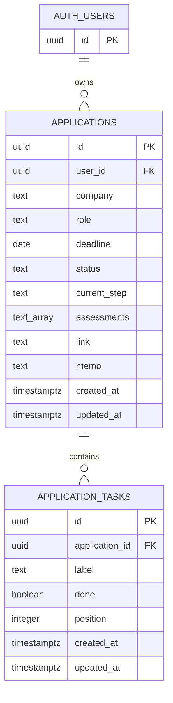

<div align="center">

# ApplyLog

### 흩어진 채용 일정과 지원 준비를 한 화면에서

기업별 마감일, 현재 전형, 코딩테스트·인적성·AI 역량검사, 체크리스트와 메모를 관리하는 개인용 취업 지원 트래커


[주요 기능](#-주요-기능) · [실행 방법](#-빠른-시작) · [Supabase 연결](#-supabase-연결) · [문서](#-문서)

</div>

---

## 서비스 화면

<table>
  <tr>
    <td align="center" width="60%">
      <strong>지원 현황 대시보드</strong><br/>
      <sub>docs/images/dashboard.png</sub><br/><br/>
      <em>스크린샷을 추가할 자리입니다.</em>
    </td>
    <td align="center" width="40%">
      <strong>지원 상세</strong><br/>
      <sub>docs/images/application-detail.png</sub><br/><br/>
      <em>스크린샷을 추가할 자리입니다.</em>
    </td>
  </tr>
</table>

> [!TIP]
> 이미지 파일명과 권장 크기는 [`docs/images/README.md`](./docs/images/README.md)에 정리되어 있습니다. 실제 지원 정보가 노출되지 않도록 샘플 데이터로 촬영하세요.

## 왜 만들었나요?

지원할 기업이 늘어나면 포스트잇에는 마감일을, 노션에는 기업 분석을, 머릿속에는 현재 전형을 따로 기억하게 됩니다. 그 결과 **지원했는지**, **어떤 시험을 보는지**, **지금 무엇을 준비해야 하는지** 놓치기 쉽습니다.

ApplyLog는 긴 문서를 보관하는 도구가 아니라, 취업 준비 중 매일 열어보는 **진행 상황 대시보드**에 집중합니다.

```text
지원 정보 등록 → 마감 확인 → 현재 단계 갱신 → 체크리스트 수행 → 메모 축적
```

## ✨ 주요 기능

| | 기능 | 설명 |
| --- | --- | --- |
| 📅 | **마감 관리** | 마감일 기준 자동 정렬, D-Day 계산, 3일 내 마감 강조 |
| 🧭 | **전형 단계 관리** | 지원 준비부터 서류·검사·면접·최종 결과까지 현재 단계 지정 |
| 🧪 | **평가 방식 기록** | 코딩테스트, 인적성, AI 역량검사를 기업별로 복수 선택 |
| ✅ | **준비 체크리스트** | 할 일을 추가하고 완료율을 확인하며 항목별 준비 상태 관리 |
| 📝 | **리치 텍스트 메모** | 기업 분석과 준비 내용을 서식이 있는 메모로 기록 |
| 🔎 | **검색과 필터** | 기업명·직무 검색 및 마감 임박·전형 진행·면접 필터 제공 |
| 📱 | **반응형 UI** | 데스크톱과 모바일 화면에 맞춰 지원 현황 확인 |
| 💾 | **자동 저장** | 입력한 내용을 현재 브라우저의 `localStorage`에 자동 저장 |

> [!IMPORTANT]
> 현재 애플리케이션은 로컬 저장 방식입니다. 데이터는 사용 중인 브라우저에만 남으며, 브라우저 데이터를 삭제하면 함께 사라집니다. 민감한 개인정보는 메모에 저장하지 마세요.

## 🛠 기술 구성

| 영역 | 기술 | 역할 |
| --- | --- | --- |
| Framework | Next.js 16 App Router | 애플리케이션 구조와 렌더링 |
| UI | React 19 | 화면 상태와 사용자 상호작용 |
| Language | TypeScript | 채용 단계·평가 유형 등 도메인 타입 관리 |
| Styling | Tailwind CSS 4 | 반응형 레이아웃과 UI 스타일 |
| Local Storage | Web Storage API | 별도 계정 없이 사용하는 로컬 데이터 저장 |
| Backend Setup | Supabase | 사용자별 Auth·PostgreSQL·RLS 연결을 위한 설정 자료 제공 |

## 🚀 빠른 시작

> Node.js 20.9 이상과 npm이 필요합니다.

```bash
git clone <YOUR_REPOSITORY_URL>
cd job-tracker
npm install
npm run dev
```

브라우저에서 [http://localhost:3000](http://localhost:3000)을 엽니다.

<details>
<summary><strong>사용 가능한 npm 명령어 보기</strong></summary>

| 명령어 | 설명 |
| --- | --- |
| `npm run dev` | 개발 서버 실행 |
| `npm run lint` | ESLint 정적 검사 |
| `npm run build` | 프로덕션 빌드 생성 |
| `npm run start` | 생성된 프로덕션 빌드 실행 |

</details>

## 🟢 Supabase 연결

이 저장소에는 각 사용자가 **자신의 Supabase 프로젝트**를 연결할 수 있도록 환경변수 템플릿, 데이터베이스 스키마, RLS 정책과 설정 가이드가 포함되어 있습니다.

> [!NOTE]
> Supabase 설정 자료는 준비되어 있지만 현재 화면의 데이터 처리는 아직 `localStorage`를 사용합니다. Auth와 Supabase CRUD 코드가 적용되기 전까지 환경변수만 등록해도 저장 방식이 자동으로 바뀌지는 않습니다.

<details>
<summary><strong>Supabase 준비 과정 펼쳐보기</strong></summary>

1. Supabase에서 새 프로젝트를 생성합니다.
2. [`.env.example`](./.env.example)을 `.env.local`로 복사합니다.
3. 본인의 Project URL과 Publishable Key를 입력합니다.
4. [`docs/supabase/schema.sql`](./docs/supabase/schema.sql)을 SQL Editor에서 실행합니다.
5. 이메일 또는 OAuth Provider와 Redirect URL을 설정합니다.
6. 두 개의 테스트 계정으로 사용자 데이터가 분리되는지 검증합니다.

```bash
cp .env.example .env.local
```

```dotenv
NEXT_PUBLIC_SUPABASE_URL=https://YOUR_PROJECT_REF.supabase.co
NEXT_PUBLIC_SUPABASE_PUBLISHABLE_KEY=sb_publishable_YOUR_KEY
```

</details>

전체 과정은 **[Supabase 연결 가이드](./docs/SUPABASE_SETUP.md)**에서 확인할 수 있습니다.

> [!WARNING]
> `service_role`, Secret key, Database Password는 브라우저 환경변수에 넣거나 GitHub에 커밋하면 안 됩니다. 공개 클라이언트의 데이터 접근은 로그인과 Row Level Security로 제한해야 합니다.

## 📚 문서

| 문서 | 내용 |
| --- | --- |
| [Supabase 연결 가이드](./docs/SUPABASE_SETUP.md) | 프로젝트 생성, 환경변수, Auth, Redirect URL, RLS 검증 |
| [데이터베이스 스키마](./docs/supabase/schema.sql) | 지원 정보·체크리스트 테이블, 인덱스, RLS 정책 |
| [서비스 이미지 가이드](./docs/images/README.md) | README에 사용할 화면과 파일명, 권장 크기 |

<details>
<summary><strong>프로젝트 구조 보기</strong></summary>

```text
.
├── docs/
│   ├── SUPABASE_SETUP.md
│   ├── images/
│   └── supabase/
│       └── schema.sql
├── public/
├── src/
│   ├── app/
│   ├── components/
│   │   ├── job-dashboard.tsx
│   │   ├── rich-text-editor.tsx
│   │   └── icons.tsx
│   ├── data/
│   │   └── sample-jobs.ts
│   └── types/
│       └── job.ts
├── .env.example
└── package.json
```

</details>

## 데이터베이스 스키마



`AUTH_USERS`는 Supabase가 관리하는 `auth.users`입니다. 사용자 삭제 시 지원 정보가, 지원 정보 삭제 시 연결된 체크리스트가 함께 삭제되도록 구성했습니다. 전체 DDL과 RLS 정책은 [schema.sql](./docs/supabase/schema.sql)에서 확인할 수 있습니다.

---

<div align="center">
  <sub>취업 준비 과정에서 실제로 겪은 일정 관리 문제를 해결하기 위해 만든 프로젝트입니다.</sub>
</div>
