<div align="center">

# ApplyLog × Supabase 운영 설정

하나의 Supabase 프로젝트에서 관리자 승인형 회원가입과 사용자별 데이터 격리를 구성하는 방법

[구조](#서비스-구조) · [프로젝트 설정](#1-supabase-프로젝트와-환경변수) · [관리자](#3-최초-관리자-생성) · [승인 흐름](#5-가입-요청과-승인-흐름) · [검증](#6-반드시-검증할-항목)

</div>

---

> [!IMPORTANT]
> ApplyLog 운영자는 Supabase 프로젝트 하나를 관리합니다. 일반 사용자는 Supabase 계정을 만들거나 자신의 프로젝트를 연결하지 않습니다. 사용자는 ApplyLog에서 가입을 요청하고, 관리자가 승인한 사람만 초대 메일을 통해 계정을 활성화합니다.

## 서비스 구조

```mermaid
flowchart LR
    G["방문자"] -->|가입 요청| R["access_requests"]
    R -->|pending 목록| A["관리자 화면"]
    A -->|승인| API["Next.js 서버 API"]
    API -->|Secret Key| INV["Supabase Admin API"]
    INV -->|초대 메일| U["승인된 사용자"]
    U -->|비밀번호 설정| AUTH["Supabase Auth"]
    AUTH --> APP["ApplyLog"]
    APP -->|RLS| DB["본인 지원 데이터"]
```



### 핵심 원칙

- 공개 회원가입은 비활성화합니다.
- 가입 요청자는 아직 `auth.users` 사용자가 아닙니다.
- 관리자가 승인할 때 서버에서 `inviteUserByEmail()`을 호출합니다.
- Secret Key는 Next.js 서버에서만 사용합니다.
- 관리자 권한은 이메일 비교가 아니라 `user_roles` 테이블로 판별합니다.
- 일반 사용자는 RLS를 통해 자신의 지원 정보만 CRUD할 수 있습니다.

> [!NOTE]
> 관리자 이메일은 최초 권한 부여에만 사용합니다. 애플리케이션 코드에 특정 이메일을 하드코딩하지 않습니다.

## 데이터베이스 스키마

```mermaid
erDiagram
    AUTH_USERS ||--|| USER_ROLES : has
    AUTH_USERS ||--o{ APPLICATIONS : owns
    AUTH_USERS ||--o{ ACCESS_REQUESTS : reviews
    AUTH_USERS o|--o| ACCESS_REQUESTS : invited_as
    APPLICATIONS ||--o{ APPLICATION_TASKS : contains

    AUTH_USERS {
        uuid id PK
        text email
    }

    USER_ROLES {
        uuid user_id PK_FK
        text role
        timestamptz created_at
    }

    ACCESS_REQUESTS {
        uuid id PK
        text email UK
        text name
        text reason
        text status
        timestamptz requested_at
        timestamptz reviewed_at
        uuid reviewed_by FK
        uuid invited_user_id FK
    }

    APPLICATIONS {
        uuid id PK
        uuid user_id FK
        text company
        text role
        date deadline
        text status
        text current_step
        text_array assessments
        text link
        text memo
        timestamptz created_at
        timestamptz updated_at
    }

    APPLICATION_TASKS {
        uuid id PK
        uuid application_id FK
        text label
        boolean done
        integer position
        timestamptz created_at
        timestamptz updated_at
    }
```

## 1. Supabase 프로젝트와 환경변수

### 목표

운영자 소유의 Supabase 프로젝트 하나를 만들고 공개 키와 서버 전용 키를 구분합니다.

### 직접 할 단계

1. [Supabase Dashboard](https://supabase.com/dashboard)에서 `New project`를 선택합니다.
2. 프로젝트 이름, Region, Database Password와 요금제를 확인합니다.
3. 프로젝트 생성 후 `Connect` 또는 `Project Settings → API Keys`를 엽니다.
4. Project URL, Publishable Key, Secret Key를 확인합니다.
5. 프로젝트 루트에서 환경변수 파일을 만듭니다.

```bash
cp .env.example .env.local
```

6. `.env.local`에 운영 프로젝트의 값을 입력합니다.

```dotenv
NEXT_PUBLIC_SUPABASE_URL=https://YOUR_PROJECT_REF.supabase.co
NEXT_PUBLIC_SUPABASE_PUBLISHABLE_KEY=sb_publishable_YOUR_KEY
SUPABASE_SECRET_KEY=sb_secret_YOUR_KEY
```

| 변수 | 실행 위치 | 용도 |
| --- | --- | --- |
| `NEXT_PUBLIC_SUPABASE_URL` | 브라우저·서버 | 프로젝트 API 주소 |
| `NEXT_PUBLIC_SUPABASE_PUBLISHABLE_KEY` | 브라우저·서버 | 로그인 및 RLS가 적용되는 일반 요청 |
| `SUPABASE_SECRET_KEY` | 서버 전용 | 가입 요청 저장, 사용자 초대, 승인 상태 갱신 |

> [!CAUTION]
> Secret Key는 RLS를 우회합니다. 변수 이름에 `NEXT_PUBLIC_`을 붙이거나 Client Component에서 읽거나 GitHub에 커밋하면 안 됩니다.

### 검증

```bash
git status --short
```

`.env.local`이 출력되지 않아야 정상입니다. `.env.example`에는 실제 키가 아닌 예시 값만 남겨야 합니다.

## 2. 스키마와 RLS 생성

1. Supabase Dashboard에서 `SQL Editor → New query`로 이동합니다.
2. [`docs/supabase/schema.sql`](./supabase/schema.sql)의 전체 내용을 붙여 넣습니다.
3. 실행 대상 프로젝트를 확인하고 `Run`을 선택합니다.

SQL은 다음 리소스를 생성합니다.

| 리소스 | 역할 |
| --- | --- |
| `user_roles` | `admin`과 `user` 권한 저장 |
| `access_requests` | 가입 요청과 승인 결과 저장 |
| `applications` | 사용자별 지원 정보 저장 |
| `application_tasks` | 지원별 체크리스트 저장 |
| `private.is_admin()` | RLS에서 안전하게 관리자 여부 확인 |
| `handle_new_user_role()` | 초대된 Auth 사용자에게 기본 `user` 역할 부여 |

### 예상 결과

`Table Editor`에서 네 테이블이 보이고 각 테이블의 RLS가 활성화되어야 합니다.

### 검증

`Database → Policies`에서 다음 접근 규칙을 확인합니다.

- `anon`은 네 테이블을 직접 읽거나 쓸 수 없습니다.
- 로그인 사용자는 자신의 `user_roles` 행만 읽습니다.
- 관리자는 가입 요청을 조회하고 상태를 변경할 수 있습니다.
- 일반 사용자는 자신의 `applications`와 하위 task만 CRUD할 수 있습니다.

> [!NOTE]
> 공개 가입 요청 폼은 `anon`이 테이블에 직접 insert하지 않습니다. Next.js 서버 Route Handler가 입력 검증·속도 제한을 수행한 뒤 Secret Key로 저장합니다.

## 3. 최초 관리자 생성

### 3-1. Auth 사용자 생성

1. `Authentication → Users`로 이동합니다.
2. `Add user → Create new user`를 선택합니다.
3. 운영자 이메일과 강력한 비밀번호를 입력합니다.
4. 본인이 소유한 이메일임을 확인하고 사용자를 생성합니다.

> [!WARNING]
> 관리자 이메일과 비밀번호를 저장소 또는 문서에 기록하지 마세요. 이 저장소는 특정 이메일을 하드코딩하지 않습니다.

### 3-2. admin 역할 부여

SQL Editor에서 아래 SQL의 이메일 예시를 실제 관리자 이메일로 바꿔 한 번만 실행합니다.

```sql
insert into public.user_roles (user_id, role)
select id, 'admin'
from auth.users
where lower(email) = lower('YOUR_ADMIN_EMAIL')
on conflict (user_id)
do update set role = excluded.role;
```

### 검증

다음 SQL은 관리자 계정 한 행과 `admin` 역할을 반환해야 합니다.

```sql
select u.email, r.role
from auth.users as u
join public.user_roles as r on r.user_id = u.id
where r.role = 'admin';
```

관리자 이메일을 바꾸려면 새 사용자에게 먼저 `admin` 역할을 부여하고 로그인 검증을 마친 뒤 기존 권한을 변경합니다. 유일한 관리자 권한을 먼저 제거하지 마세요.

## 4. 공개 회원가입 차단

1. `Authentication → Providers`로 이동합니다.
2. `User Signups` 영역의 `Allow new users to sign up`을 끕니다.
3. Email Provider는 기존 사용자 로그인과 초대 수락에 필요하므로 활성 상태를 유지합니다.
4. 익명 로그인을 사용하지 않는다면 `Allow anonymous sign-ins`도 끕니다.

### 예상 결과

일반 사용자가 `signUp()`을 직접 호출해도 새 계정을 만들 수 없고, 기존 사용자 로그인과 관리자 초대는 계속 동작합니다.

> [!IMPORTANT]
> 가입 버튼을 UI에서 숨기는 것만으로는 공개 가입이 차단되지 않습니다. Supabase Auth 설정 자체에서 신규 가입을 꺼야 합니다.

## 5. 가입 요청과 승인 흐름

### 가입 요청

로그인하지 않은 방문자는 이름, 이메일, 사용 목적을 제출합니다. 브라우저가 Supabase 테이블에 직접 쓰지 않고 다음 서버 API를 호출하도록 구현합니다.

```text
POST /api/access-requests
```

서버 Route Handler는 다음 작업을 수행해야 합니다.

1. 이메일을 소문자로 정규화합니다.
2. 필수 입력과 길이를 검증합니다.
3. 동일 이메일의 중복 요청을 처리합니다.
4. IP 또는 이메일 기준 속도 제한을 적용합니다.
5. 필요하면 CAPTCHA를 검증합니다.
6. Secret Key 클라이언트로 `access_requests`에 저장합니다.

### 관리자 승인

관리자는 로그인 후 `pending` 요청만 확인하고 승인 또는 거절합니다.

승인 API의 권장 순서:

1. 요청한 사용자의 세션을 검증합니다.
2. `user_roles`에서 요청자가 `admin`인지 확인합니다.
3. 요청 상태가 아직 `pending`인지 확인합니다.
4. 서버 전용 클라이언트로 `inviteUserByEmail(email)`을 호출합니다.
5. 성공 시 요청을 `approved`로 변경합니다.
6. `reviewed_by`, `reviewed_at`, `invited_user_id`를 기록합니다.

```ts
await supabaseAdmin.auth.admin.inviteUserByEmail(request.email, {
  redirectTo: `${siteUrl}/auth/callback`,
});
```

> [!WARNING]
> `inviteUserByEmail()`은 Secret Key가 필요한 관리자 작업입니다. 브라우저 이벤트 핸들러나 Client Component에서 호출하면 안 됩니다.

### 초대 수락

승인된 사용자는 Supabase의 Invite user 이메일을 받습니다. 링크를 열어 비밀번호를 설정하면 Auth 사용자가 활성화되고 `handle_new_user_role()` 트리거가 기본 `user` 역할을 보장합니다.

초대 링크의 `redirectTo` 주소는 `Authentication → URL Configuration → Redirect URLs`에 미리 등록해야 합니다. 초대 링크가 만료되면 관리자가 다시 보내야 합니다.

## 6. 반드시 검증할 항목

### 가입 정책

- [ ] 공개 `signUp()`으로 계정을 만들 수 없다.
- [ ] 미승인 이메일은 로그인할 수 없다.
- [ ] 관리자가 승인하면 초대 메일이 발송된다.
- [ ] 초대 수락 후 로그인할 수 있다.
- [ ] 거절된 요청은 Auth 사용자로 생성되지 않는다.

### 관리자 권한

- [ ] 관리자만 가입 요청 목록을 볼 수 있다.
- [ ] 일반 사용자가 승인 API를 호출하면 `403`이 반환된다.
- [ ] 브라우저 응답과 번들에 Secret Key가 포함되지 않는다.
- [ ] 관리자 판별을 이메일 문자열로 처리하지 않는다.

### 사용자 데이터 격리

#### SQL로 정책 검증

1. `Authentication → Users`에서 서로 다른 테스트 사용자 A와 B가 존재하는지 확인합니다.
2. 두 사용자의 UUID를 복사합니다. 이메일이나 비밀번호는 복사하지 않습니다.
3. [`docs/supabase/rls-verification.sql`](./supabase/rls-verification.sql)을 엽니다.
4. `REPLACE_WITH_USER_A_UUID`, `REPLACE_WITH_USER_B_UUID`를 복사한 UUID로 바꿉니다.
5. Supabase Dashboard의 `SQL Editor → New query`에 전체 SQL을 붙여 넣고 실행합니다.

마지막 결과의 `all_rls_tests_passed`가 `true`면 다음 항목을 통과한 것입니다.

- 사용자별 `auth.uid()` 인식
- 본인 `applications` 조회·수정 허용
- 다른 사용자의 `applications` 조회·수정·삭제 차단
- 본인 `application_tasks` 조회 허용
- 다른 사용자의 application에 task 생성 차단

스크립트는 하나의 트랜잭션에서 실행되고 마지막에 `ROLLBACK`하므로 테스트 데이터가 남지 않습니다.

#### 실제 애플리케이션으로 검증

1. 테스트 계정 A로 로그인해 지원 정보와 체크리스트를 생성합니다.
2. 로그아웃한 뒤 테스트 계정 B로 로그인합니다.
3. A의 지원 정보가 조회되지 않는지 확인합니다.
4. B의 세션으로 A의 행을 수정하거나 삭제할 수 없는지 확인합니다.
5. A로 다시 로그인해 원본 데이터가 유지되는지 확인합니다.

> [!TIP]
> “화면에서 보이지 않는다”만으로 RLS 검증이 끝난 것은 아닙니다. 다른 사용자의 수정·삭제 요청도 차단되고 원본 행이 보존되는지 확인해야 합니다.

## 7. Redirect URL과 이메일

`Authentication → URL Configuration`에서 환경별 주소를 등록합니다.

개발 환경:

```text
Site URL: http://localhost:3000
Redirect URL: http://localhost:3000/**
```

운영 환경:

```text
Site URL: https://YOUR_DOMAIN
Redirect URL: https://YOUR_DOMAIN/**
```

Vercel Preview에서도 초대·로그인을 테스트한다면 다음 패턴을 추가할 수 있습니다.

```text
https://*-YOUR_TEAM_OR_ACCOUNT_SLUG.vercel.app/**
```

`Authentication → Email Templates → Invite user`에서 초대 메일 문구도 ApplyLog에 맞게 수정합니다.

## 8. Vercel 환경변수

Vercel에서 다음 경로로 이동합니다.

```text
Project → Settings → Environment Variables
```

세 환경변수를 등록합니다.

```text
NEXT_PUBLIC_SUPABASE_URL
NEXT_PUBLIC_SUPABASE_PUBLISHABLE_KEY
SUPABASE_SECRET_KEY
```

Secret Key는 서버에서만 읽히지만 Vercel 환경변수 화면에서도 Production·Preview 적용 범위를 신중하게 선택합니다. 값을 변경한 후에는 새 Deployment가 필요합니다.

## 운영 시 주의사항

<details>
<summary><strong>가입 요청 스팸</strong></summary>

공개 요청 API에는 속도 제한과 입력 길이 제한을 적용합니다. 외부 공개 후 스팸이 발생하면 CAPTCHA와 이메일 도메인 차단 정책을 추가합니다.

</details>

<details>
<summary><strong>중복 승인</strong></summary>

승인 직전에 요청이 `pending`인지 다시 확인합니다. 동일 이메일을 다시 초대하면 이미 존재하는 사용자 오류가 발생할 수 있으므로 요청 상태와 Auth 사용자를 함께 확인합니다.

</details>

<details>
<summary><strong>초대는 성공했지만 요청 상태 갱신이 실패함</strong></summary>

Auth 사용자 생성과 데이터베이스 업데이트는 하나의 DB 트랜잭션이 아닙니다. 서버 로그에 초대 결과를 남기고, 관리 화면에서 Auth 사용자와 요청 상태를 재조정할 수 있는 복구 절차를 둡니다.

</details>

<details>
<summary><strong>관리자 계정 보호</strong></summary>

관리자 비밀번호는 재사용하지 않고 가능한 경우 MFA를 활성화합니다. 관리자 세션이 탈취되면 사용자 초대 권한과 가입 요청 정보가 노출될 수 있습니다.

</details>

## 참고 자료

- [Supabase User Management and Invitations](https://supabase.com/docs/guides/auth/managing-user-data)
- [Supabase JavaScript Admin API](https://supabase.com/docs/reference/javascript/admin-api)
- [Supabase General Auth Configuration](https://supabase.com/docs/guides/auth/general-configuration)
- [Supabase API Keys](https://supabase.com/docs/guides/api/api-keys)
- [Supabase Row Level Security](https://supabase.com/docs/guides/database/postgres/row-level-security)
- [Supabase Redirect URLs](https://supabase.com/docs/guides/auth/redirect-urls)
