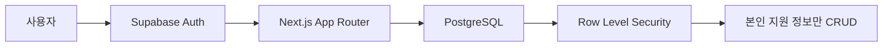
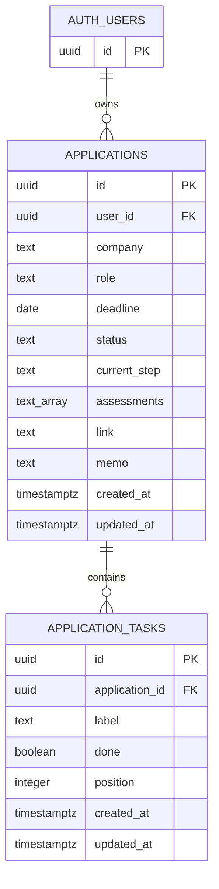

<div align="center">

# ApplyLog × Supabase 설정 가이드

각 사용자가 자신의 Supabase 프로젝트에 Auth, PostgreSQL, RLS를 구성하는 방법

[프로젝트 생성](#1-supabase-프로젝트-생성) · [환경변수](#2-api-키와-환경변수) · [데이터베이스](#3-데이터베이스-생성) · [인증](#4-인증-설정) · [검증](#6-보안-검증)

</div>

---

> [!IMPORTANT]
> 현재 ApplyLog 화면은 `localStorage`를 사용합니다. 이 가이드는 Supabase 리소스를 준비하는 문서이며, Auth와 CRUD 코드가 애플리케이션에 적용되기 전까지 저장 방식이 자동으로 변경되지는 않습니다.

## 완료 목표

이 문서를 끝까지 수행하면 다음 리소스가 준비됩니다.



- Supabase 프로젝트와 PostgreSQL 데이터베이스
- Next.js에서 사용할 Project URL과 Publishable Key
- `applications`, `application_tasks` 테이블
- 사용자별 데이터 접근을 제한하는 RLS 정책
- 이메일 로그인을 위한 Auth 설정
- localhost와 배포 주소의 Redirect URL

## 먼저 확인할 것

| 항목 | 기준 |
| --- | --- |
| Node.js | 20.9 이상 |
| 패키지 관리자 | npm |
| 작업 위치 | `job-tracker` 프로젝트 루트 |
| Supabase | 본인 계정과 프로젝트 생성 권한 |

프로젝트의 현재 Node.js 버전을 확인합니다.

```bash
node --version
```

`v20.9.0` 이상이면 다음 단계로 진행합니다.

## 1. Supabase 프로젝트 생성

### 목표

ApplyLog 전용 PostgreSQL과 Auth 리소스를 만듭니다.

### 직접 할 단계

1. [Supabase Dashboard](https://supabase.com/dashboard)에 로그인합니다.
2. `New project`를 선택합니다.
3. 프로젝트를 소유할 Organization을 선택합니다.
4. 프로젝트 이름을 입력합니다. 예: `applylog`
5. 강력한 Database Password를 생성해 비밀번호 관리자에 보관합니다.
6. 실제 사용자와 가까운 Region을 선택합니다.
7. 표시되는 요금제와 예상 비용을 확인한 뒤 프로젝트를 생성합니다.

> [!CAUTION]
> 프로젝트 생성은 클라우드 리소스를 만듭니다. 유료 플랜을 선택하거나 추가 리소스를 활성화하기 전에 과금 조건을 확인하세요. Database Password는 GitHub, `.env.local`, 채팅에 붙여 넣지 않습니다.

### 예상 화면

프로젝트 준비가 끝나면 Dashboard에 `Table Editor`, `SQL Editor`, `Authentication`, `Project Settings` 메뉴가 표시됩니다.

### 검증

Dashboard 상단에서 방금 만든 프로젝트 이름과 Region이 맞는지 확인합니다.

## 2. API 키와 환경변수

### 목표

Next.js가 본인의 Supabase 프로젝트를 찾을 수 있도록 공개 연결 정보를 설정합니다.

### 키 선택 기준

| 키 | 사용 위치 | RLS | 이 프로젝트에서 사용 |
| --- | --- | --- | --- |
| `sb_publishable_...` | 브라우저·일반 클라이언트 | 적용 | ✅ 사용 |
| Legacy `anon` | 이전 프로젝트의 공개 클라이언트 | 적용 | 호환은 되지만 신규 설정에서는 비권장 |
| `sb_secret_...` | 신뢰할 수 있는 백엔드 | 우회 | ❌ 사용하지 않음 |
| Legacy `service_role` | 신뢰할 수 있는 백엔드 | 우회 | ❌ 사용하지 않음 |

> [!WARNING]
> Secret 또는 `service_role` 키는 RLS를 우회합니다. `NEXT_PUBLIC_` 변수에 넣거나 브라우저 코드, GitHub에 노출하면 안 됩니다.

### 직접 할 단계

1. 프로젝트 Dashboard에서 `Connect`를 엽니다.
2. Project URL과 Publishable Key를 확인합니다.
3. 찾기 어렵다면 `Project Settings → API Keys`도 확인합니다.
4. 프로젝트 루트에서 환경변수 예시를 복사합니다.

```bash
cp .env.example .env.local
```

5. `.env.local`을 열고 본인의 값으로 교체합니다.

```dotenv
NEXT_PUBLIC_SUPABASE_URL=https://YOUR_PROJECT_REF.supabase.co
NEXT_PUBLIC_SUPABASE_PUBLISHABLE_KEY=sb_publishable_YOUR_KEY
```

### 예상 결과

프로젝트 루트에 `.env.local`이 생기고 두 변수에 더 이상 `YOUR_...` 예시 값이 남아 있지 않아야 합니다.

### 검증

`.env.local`이 Git 커밋 대상에서 제외되는지 확인합니다.

```bash
git status --short
```

출력에 `.env.local`이 보이지 않아야 정상입니다. 반대로 `.env.example`은 저장소에 포함되어야 합니다.

## 3. 데이터베이스 생성

### 스키마



- `AUTH_USERS`는 Supabase Auth가 관리하는 `auth.users`를 의미합니다.
- 사용자가 탈퇴하면 해당 사용자의 `applications`도 함께 삭제됩니다.
- 지원 정보가 삭제되면 연결된 `application_tasks`도 함께 삭제됩니다.
- `assessments`에는 코딩테스트·인적성·AI 역량검사를 복수로 저장합니다.

### 직접 할 단계

1. Dashboard에서 `SQL Editor`로 이동합니다.
2. `New query`를 선택합니다.
3. [`docs/supabase/schema.sql`](./supabase/schema.sql)을 열어 전체 SQL을 복사합니다.
4. SQL Editor에 붙여 넣습니다.
5. 상단의 프로젝트 이름을 다시 확인합니다.
6. `Run`을 선택합니다.

### 이 SQL이 만드는 것

<details>
<summary><strong>생성 리소스 펼쳐보기</strong></summary>

| 리소스 | 목적 |
| --- | --- |
| `applications` | 기업, 직무, 마감일, 전형, 링크, 메모 저장 |
| `application_tasks` | 지원 정보별 체크리스트 저장 |
| 조회 인덱스 | 사용자·마감일·현재 단계·체크리스트 순서 조회 최적화 |
| `set_updated_at()` | 수정 시각 자동 갱신 |
| RLS 정책 | 로그인한 사용자가 자신의 데이터만 CRUD하도록 제한 |

</details>

### 예상 출력

SQL Editor에 성공 메시지가 표시되고 오류가 없어야 합니다.

### 검증

1. `Table Editor`에서 `applications`와 `application_tasks`를 확인합니다.
2. 각 테이블을 열어 컬럼과 타입을 확인합니다.
3. 테이블의 RLS 표시가 활성화되어 있는지 확인합니다.
4. `Database → Policies`에서 각 테이블의 정책을 확인합니다.

> [!NOTE]
> Table Editor는 관리자 권한으로 데이터를 보여줄 수 있습니다. Table Editor에서 행이 보인다는 사실만으로 RLS가 실패한 것은 아닙니다. 최종 검증은 서로 다른 두 사용자 세션으로 수행합니다.

## 4. 인증 설정

### 이메일 로그인

1. `Authentication → Providers`로 이동합니다.
2. Email Provider가 활성화되어 있는지 확인합니다.
3. 이메일 확인 절차를 사용할지 결정합니다.

운영 환경에서는 사용자가 실제로 소유한 이메일인지 확인할 수 있도록 이메일 확인 기능을 유지하는 것을 권장합니다.

### URL Configuration

1. `Authentication → URL Configuration`으로 이동합니다.
2. 개발 중이라면 Site URL을 다음과 같이 설정합니다.

```text
http://localhost:3000
```

3. Redirect URLs에 다음 주소를 추가합니다.

```text
http://localhost:3000/**
```

4. 운영 배포 후에는 Site URL을 실제 운영 주소로 변경합니다.
5. Vercel Preview도 인증 테스트에 사용한다면 팀 또는 계정 slug에 맞는 Preview 패턴을 추가합니다.

```text
https://*-YOUR_TEAM_OR_ACCOUNT_SLUG.vercel.app/**
```

> [!TIP]
> Site URL은 기본 복귀 주소이고 Redirect URL 목록은 허용 목록입니다. 주소의 `http`·`https`, 포트, 도메인이 실제 실행 환경과 정확히 일치해야 합니다.

<details>
<summary><strong>Google 로그인도 사용할 경우</strong></summary>

1. Google Cloud Console에서 OAuth 동의 화면을 구성합니다.
2. Web application 타입의 OAuth Client를 만듭니다.
3. Supabase가 안내하는 Callback URL을 Google의 Authorized redirect URI에 등록합니다.
4. `Authentication → Providers → Google`을 엽니다.
5. Google Client ID와 Client Secret을 입력하고 활성화합니다.

Google Client Secret은 Supabase Dashboard에만 입력합니다. `NEXT_PUBLIC_` 환경변수에 저장하지 않습니다.

</details>

## 5. Next.js 연결 준비

### 패키지 설치

프로젝트 루트에서 Supabase JavaScript Client와 SSR 패키지를 설치합니다.

```bash
npm install @supabase/supabase-js @supabase/ssr
```

설치 후 `package.json`의 `dependencies`에 두 패키지가 보여야 합니다.

### 권장 파일 구조

```text
src/lib/supabase/
├── client.ts   # Client Component와 브라우저 요청
├── server.ts   # Server Component, Route Handler, Server Action
└── proxy.ts    # 인증 쿠키 갱신 로직
```

Next.js App Router에서는 브라우저 클라이언트와 서버 클라이언트를 분리합니다. 서버 렌더링에서 인증 쿠키를 읽고 갱신할 때는 `@supabase/ssr`을 사용하며, 보호된 서버 작업은 Supabase가 검증한 claims를 기준으로 판단합니다.

> [!IMPORTANT]
> 애플리케이션의 로그인 확인만으로는 데이터가 보호되지 않습니다. 브라우저 요청은 조작될 수 있으므로 PostgreSQL RLS가 최종 접근 제어를 담당해야 합니다.

## 6. 보안 검증

연동 코드까지 적용한 뒤 아래 순서로 확인합니다.

### 기본 사용자 흐름

- [ ] 회원가입 후 로그인할 수 있다.
- [ ] 로그아웃 후 보호된 화면에 접근할 수 없다.
- [ ] 지원 정보를 생성·조회·수정·삭제할 수 있다.
- [ ] 새로고침 후에도 데이터가 유지된다.
- [ ] 체크리스트가 지원 정보와 함께 조회된다.

### RLS 격리 테스트

1. 테스트 계정 A로 로그인합니다.
2. 식별하기 쉬운 지원 정보를 한 건 생성합니다.
3. 로그아웃합니다.
4. 테스트 계정 B로 로그인합니다.
5. 계정 A가 만든 지원 정보가 보이지 않는지 확인합니다.
6. 계정 B의 세션으로 계정 A의 행을 수정하거나 삭제할 수 없는지 확인합니다.
7. 다시 계정 A로 로그인해 원본 행이 그대로인지 확인합니다.

> [!WARNING]
> “계정 B의 화면에 행이 안 보인다”만으로 수정 차단까지 증명되지는 않습니다. B의 변경 시도가 실패하고 A의 원본 데이터가 유지되는지 함께 확인해야 합니다.

### 브라우저에서 볼 곳

DevTools의 `Network` 탭에서 Supabase 요청을 선택해 다음을 확인합니다.

- 요청 URL과 HTTP Method
- HTTP Status
- Request Payload
- Response Body의 오류 메시지
- 로그인 쿠키와 세션 갱신 여부

## 7. Vercel에 연결할 때

GitHub 저장소를 Vercel에 Import한 후 다음 경로로 이동합니다.

```text
Project → Settings → Environment Variables
```

아래 값을 Production, Preview, Development 중 필요한 환경에 등록합니다.

```text
NEXT_PUBLIC_SUPABASE_URL
NEXT_PUBLIC_SUPABASE_PUBLISHABLE_KEY
```

환경변수를 추가하거나 변경하면 새 Deployment를 실행해야 합니다. 배포가 끝나면 실제 Vercel 주소를 Supabase의 Site URL 또는 Redirect URL 허용 목록에도 반영합니다.

## 문제 해결

<details>
<summary><strong>환경변수를 읽지 못함</strong></summary>

- 파일명이 `.env.local`인지 확인합니다.
- 파일이 `package.json`과 같은 프로젝트 루트에 있는지 확인합니다.
- 변수 이름의 철자와 `NEXT_PUBLIC_` 접두사를 확인합니다.
- 개발 서버를 완전히 종료한 뒤 다시 실행합니다.

</details>

<details>
<summary><strong>로그인 후 잘못된 주소로 이동함</strong></summary>

- `Authentication → URL Configuration`의 Site URL을 확인합니다.
- localhost와 배포 주소가 Redirect URLs에 포함되어 있는지 확인합니다.
- `http`, `https`, 포트 번호를 비교합니다.
- Vercel Preview 주소를 사용한다면 wildcard 패턴의 계정 slug를 확인합니다.

</details>

<details>
<summary><strong>데이터가 조회되지 않음</strong></summary>

- 현재 사용자가 로그인되어 있는지 확인합니다.
- 해당 행의 `user_id`가 로그인 사용자 ID와 일치하는지 확인합니다.
- RLS가 활성화되어 있고 정책의 대상 role이 `authenticated`인지 확인합니다.
- DevTools `Network`에서 응답 상태와 오류 메시지를 확인합니다.

</details>

<details>
<summary><strong>다른 사용자의 데이터가 보임</strong></summary>

운영 사용을 중단하고 다음을 즉시 확인합니다.

1. 두 테이블의 RLS가 활성화되어 있는가
2. 공개 클라이언트에 Secret 또는 `service_role` 키를 사용하지 않았는가
3. 요청의 사용자 세션이 올바른가
4. 정책의 `using`과 `with check` 조건이 모두 존재하는가

</details>

## 참고 자료

- [Supabase Next.js Quickstart](https://supabase.com/docs/guides/getting-started/quickstarts/nextjs)
- [Supabase Server-Side Auth for Next.js](https://supabase.com/docs/guides/auth/server-side/nextjs)
- [Supabase Redirect URLs](https://supabase.com/docs/guides/auth/redirect-urls)
- [Supabase Row Level Security](https://supabase.com/docs/guides/database/postgres/row-level-security)
- [Supabase API Keys](https://supabase.com/docs/guides/api/api-keys)
